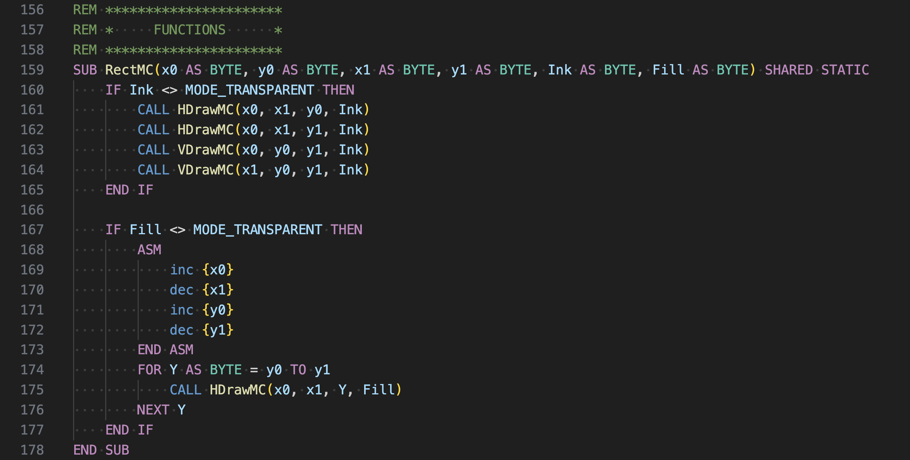

# XC=Basic 3 

Syntax highlighting for XC=BASIC 3, a cross compiled BASIC for 8-bit Commodore machines.

## Features

* Grammar definition for syntax highlighting



## Requirements

No requirements but XC=Basic 3 compiler and Vice are recommended for testing.
* https://xc-basic.net/
* https://vice-emu.sourceforge.io/

## Extension Settings

This extension contributes the following settings:

* `xcbasic.basefolder`: Absolute path of the XC-BASIC base folder (the one containing the 'bin' folder.

For now this setting is not used directly by the extension, you can use it with the following `tasks.json` and simply hit Crtl+Shift+B or Cmd+Shift+B to build the currently open XC=BASIC 3 file to a C64 prg with the same name.

```json
{
    // See https://go.microsoft.com/fwlink/?LinkId=733558
    // for the documentation about the tasks.json format
    "version": "2.0.0",
    "tasks": [
        {
            "label": "Build XC=BASIC 3 file to .prg",
            "type": "shell",
            "osx": {
                "command": "./bin/macOS/xcbasic3",
                "args": [
                    "${file}",
                    "${fileDirname}/${fileBasenameNoExtension}.prg"
                ]
            },
            "linux": {
                "command": "./bin/Linux/xcbasic3",
                "args": [
                    "${file}",
                    "${fileDirname}/${fileBasenameNoExtension}.prg"
                ]
            },
            "windows": {
                "command": "./bin/Windows/xcbasic3.exe",
                "args": [
                    "${file}",
                    "${fileDirname}\\${fileBasenameNoExtension}.prg"
                ]
            },
            "group": {
                "kind": "build",
                "isDefault": true
            },
            "options": {
                "cwd": "${config:xcbasic3.basefolder}"
            }
        }
    ]
}
```


## Known Issues

* Ugly colors
* Lot of bugs
* Some XC=Basic rules and DASM language definition is based on
  *  https://github.com/Viza74/xcbasiclanguagevscodeext
  *  https://github.com/zeh/vscode-dasm

## Release Notes

### 0.0.1

Initial release
